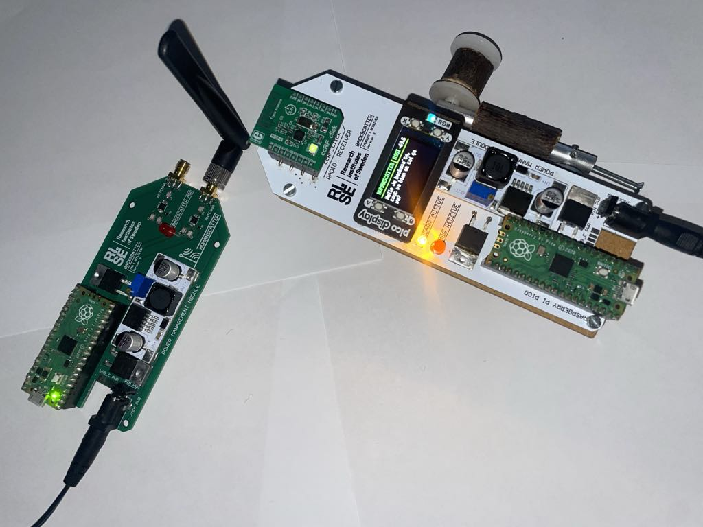

# Humanscatter

**Humanscatter** is a battery-free communication demonstrator that explores human-powered and ultra-low-power backscatter radio technologies.



## Project Overview

Humanscatter investigates how we can enable rich interactions between humans and computing systems **without batteries**, using only backscatter communication and minimal harvested energy (solar or human power). The project is based upon an educational backscatter platform, with similar architecture [educationnal backscatter platform](https://github.com/uu-core/wcnes-project2025/tree/main?tab=readme-ov-file#pico-backscatter) The Humanscatter project delivers:

- A **carrier-receiver** unit powered by a hand crank
- A backscatter tag
- Wireless communication between the two using **backscatter techniques**
- A MicroPython interface for demonstrability and accessibility

## System Architecture

### 1. **Carrier-Receiver Unit**
- Powered by hand crank (human energy)
- Hosts:
  - Two **CC2500 radios** (one emits carrier, one receives backscatter)
  - A small display for feedback
  - A **Raspberry Pi Pico** as the main controller
- Fully written in **MicroPython**

### 2. **Backscatter Tag**
- Hosts:
  - Two RF switches to encode data on the reflected signal
  - A **Raspberry Pi Pico** as the main controller
- Written in **MicroPython**, except low-level PI/O functions in **C** using the pico sdk

## Setup & Run

1. **Clone the repository:**

```bash
git clone https://github.com/amau75/Humanscatter.git
cd Humanscatter
